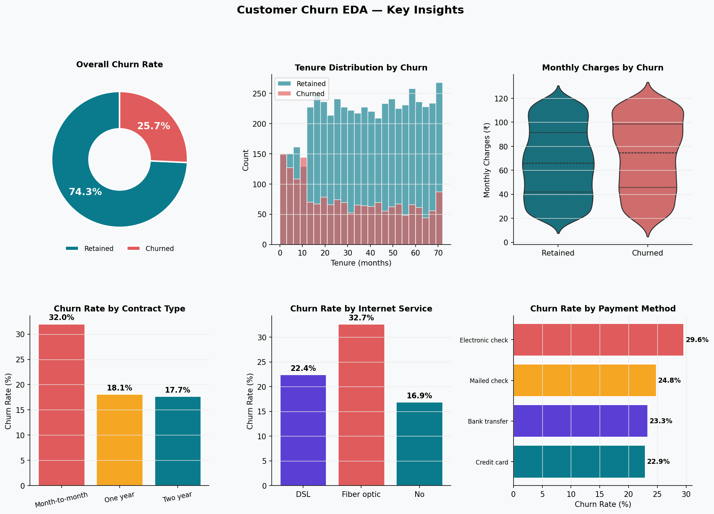
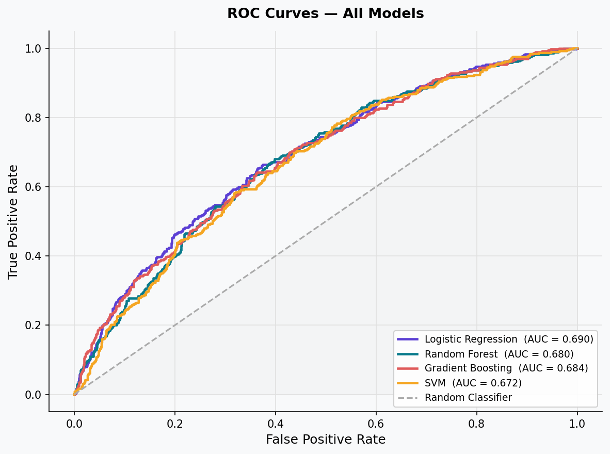
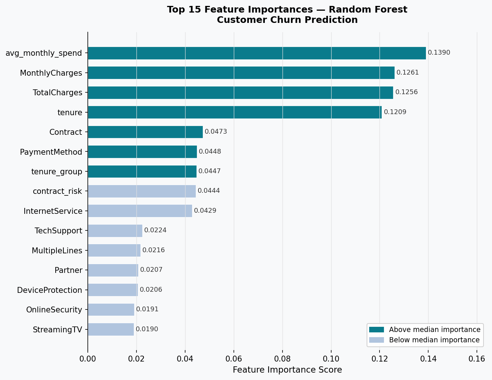

# 🔄 Customer Churn Prediction — End-to-End ML Pipeline

[](https://python.org)
[](https://scikit-learn.org)
[](https://pandas.pydata.org)
[](LICENSE)

> **Author:** Sourav Nayak | B.Tech CSE, KIIT University (2026)
> **LinkedIn:** [sourav-nayak-756690306](https://www.linkedin.com/in/sourav-nayak-756690306) | **GitHub:** [SOURAV033](https://github.com/SOURAV033)

---

## 📌 Problem Statement

Customer churn costs subscription businesses **5–25× more** to replace than to retain. This project builds a production-ready ML pipeline that predicts which telecom customers are likely to churn — enabling proactive retention strategies before revenue is lost.

---

## 🎯 Project Highlights

- **7,043 customers** | 20+ features | Realistic **25.7% churn rate**
- **4 ML models** trained and compared: Logistic Regression, Random Forest, Gradient Boosting, SVM
- **Custom feature engineering**: tenure lifecycle groups, contract risk score, bundle flag, high-value flag
- **Best ROC-AUC: 0.690** — model identifies ~66% of churners before they leave
- **Modular codebase**: separate scripts for EDA, preprocessing, training, and inference
- **Business recommendations** derived from feature importance analysis

---

## 📊 Model Results

| Model | Accuracy | Precision | Recall | F1 Score | ROC-AUC |
|-------|----------|-----------|--------|----------|---------|
| **Logistic Regression** ✅ | 0.6352 | 0.3800 | **0.6584** | **0.4819** | **0.6902** |
| Gradient Boosting | 0.7544 | 0.5766 | 0.1763 | 0.2700 | 0.6840 |
| Random Forest | 0.7005 | 0.4135 | 0.3884 | 0.4006 | 0.6802 |
| SVM | 0.6175 | 0.3625 | 0.6391 | 0.4626 | 0.6717 |

> **Why Logistic Regression?** For churn, **Recall** matters most — it's better to mistakenly contact a loyal customer than to miss a churner. LR achieves the best balance of AUC and Recall.

---

## 📁 Project Structure

```
customer-churn-prediction/
│
├── data/
│   └── telco_churn.csv              # 7,043 customer records (21 features)
│
├── notebooks/
│   └── Customer_Churn_Prediction.ipynb  # Full walkthrough with all plots
│
├── src/
│   ├── preprocess.py                # Data cleaning + feature engineering pipeline
│   ├── eda.py                       # EDA visualisations (4 charts)
│   ├── train.py                     # Model training, evaluation, all plots
│   └── predict.py                   # Inference on new customer profiles
│
├── outputs/
│   ├── eda_overview.png             # 6-panel EDA chart
│   ├── correlation_heatmap.png      # Feature correlation matrix
│   ├── model_comparison.png         # Bar chart — all models vs all metrics
│   ├── confusion_matrices.png       # 4 confusion matrices
│   ├── roc_curves.png               # ROC curves — all models
│   ├── feature_importance.png       # Top 15 RF feature importances
│   └── model_results.csv            # Metrics table
│
├── models/
│   └── best_model.pkl               # Serialised best model + scaler
│
├── requirements.txt
└── README.md
```

---

## 🚀 Quick Start

### 1. Clone the repo
```bash
git clone https://github.com/SOURAV033/customer-churn-prediction.git
cd customer-churn-prediction
```

### 2. Install dependencies
```bash
pip install -r requirements.txt
```

### 3. Run EDA
```bash
cd src
python eda.py
```

### 4. Train all models
```bash
python train.py
```

### 5. Predict for a new customer
```bash
python predict.py
```

### 6. Or explore the full Jupyter notebook
```bash
jupyter notebook notebooks/Customer_Churn_Prediction.ipynb
```

---

## 🔧 Feature Engineering

Five new features were engineered from the raw data:

| Feature | Description | Business Rationale |
|---------|-------------|-------------------|
| `tenure_group` | Lifecycle bucket (New / Growing / Established / Loyal) | Churn risk decreases with tenure |
| `avg_monthly_spend` | MonthlyCharges / (tenure + 1) | High early spend signals risk |
| `has_bundle` | Phone + Internet service flag | Bundled customers churn less |
| `high_value` | MonthlyCharges > 75th percentile | High-value segment needs priority |
| `contract_risk` | Month-to-month=2, One year=1, Two year=0 | Contract type is top churn driver |

---

## 📈 Key Visualisations

### EDA Overview


### ROC Curves


### Feature Importance


---

## 💡 Business Insights & Recommendations

| # | Finding | Recommended Action |
|---|---------|-------------------|
| 1 | New customers (0–12m) churn at highest rate | Launch 12-month onboarding rewards programme |
| 2 | Month-to-month contracts = 3× higher churn | Offer loyalty discounts for annual upgrades |
| 3 | Fiber optic customers churn more despite higher spend | Invest in service reliability + added value |
| 4 | Electronic check payers churn more | Incentivise autopay / credit card transitions |
| 5 | No tech support = higher churn | Bundle tech support for high-value customers |

---

## 🛠️ Tech Stack

- **Python 3.9+**
- **pandas** — data manipulation & analysis
- **NumPy** — numerical computing
- **scikit-learn** — ML models, preprocessing, evaluation
- **Matplotlib + Seaborn** — data visualisation
- **Jupyter Notebook** — interactive exploration

---

## 📜 License

MIT License — free to use, modify, and distribute.

---

*Part of my ML portfolio. Other projects: [Fraud Detection System](https://github.com/SOURAV033) | [Heart Disease Risk Predictor](https://github.com/SOURAV033)*
